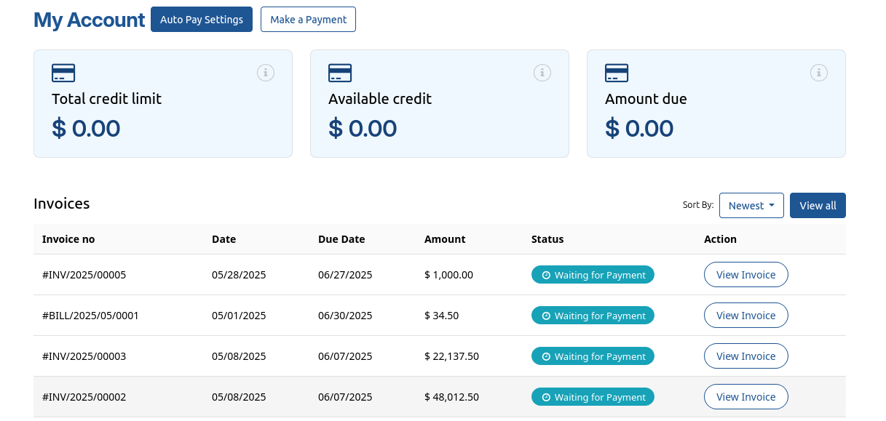

This module extends the account_banking_ach_direct_debit functionality by providing a customer portal integration for collecting bank account information securely via Plaid.

It enables customers to verify and link their bank accounts from the portal interface, allowing the company to later initiate ACH Direct Debit transactions from those accounts.

