=======================
US Sales Tax Engine
=======================

.. !!!!!!!!!!!!!!!!!!!!!!!!!!!!!!!!!!!!!!!!!!!!!!!!!!!!
   !! This file is generated by oca-gen-addon-readme !!
   !! changes will be overwritten.                   !!
   !!!!!!!!!!!!!!!!!!!!!!!!!!!!!!!!!!!!!!!!!!!!!!!!!!!!
   !! source digest: sha256:placeholder
   !!!!!!!!!!!!!!!!!!!!!!!!!!!!!!!!!!!!!!!!!!!!!!!!!!!!

.. |badge1| image:: https://img.shields.io/badge/maturity-Alpha-red.png
    :target: https://odoo-community.org/page/development-status
    :alt: Alpha
.. |badge2| image:: https://img.shields.io/badge/licence-LGPL--3-blue.png
    :target: http://www.gnu.org/licenses/lgpl-3.0-standalone.html
    :alt: License: LGPL-3
.. |badge3| image:: https://img.shields.io/badge/github-OCA%2Fl10n--usa-lightgray.png?logo=github
    :target: https://github.com/OCA/l10n-usa/tree/18.0/l10n_us_sales_tax_engine
    :alt: OCA/l10n-usa

|badge1| |badge2| |badge3|

Provider-agnostic hybrid sales tax calculation engine for all 50 US states.
Consults a local rate database first; falls back to external APIs when local
data is unavailable. Every calculation generates an immutable audit log.

**Table of contents**

.. contents::
   :local:

Features
--------

* Local tax rate database with Florida DOR seed data (67 counties)
* External API fallback chain: ZipTax, API Ninjas, TaxJar
* Response cache with configurable TTL (default: 30 days)
* Full immutable audit log per calculation
* Nexus management per company/state (economic nexus support)
* Product fiscal categories: tangible, service, food, medicine, digital, shipping, exempt
* Sale Order and Invoice integration with automatic recalculation on confirm
* Internal REST endpoints for external system integration
* Provider-agnostic architecture — easy to add new providers

Configuration
-------------

#. Go to *Accounting > Configuration > Settings > US Sales Tax Engine*
#. Enable **US Sales Tax Engine**
#. Select **Engine Mode** (Hybrid recommended)
#. Configure **Nexus** states under *Accounting > Configuration > US Sales Tax > Configuration > Nexus*
#. Enable only the API providers you have credentials for

Usage
-----

Sales Orders
~~~~~~~~~~~~

#. Open a Sales Order with a US customer address
#. Click **Calculate US Tax** button
#. The engine calculates and applies the correct state + county rate
#. Tax Source field shows: ``local``, ``api``, ``cache``, ``exempt_nexus``, or ``exempt_rule``

Calculation Logs
~~~~~~~~~~~~~~~~

All calculations are logged under
*Accounting > Configuration > US Sales Tax > Audit > Calculation Logs*

Screenshots
-----------

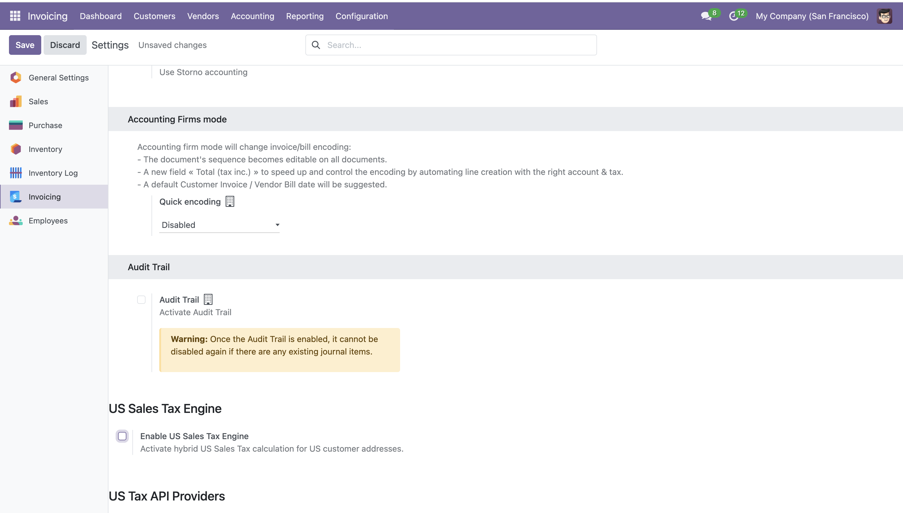

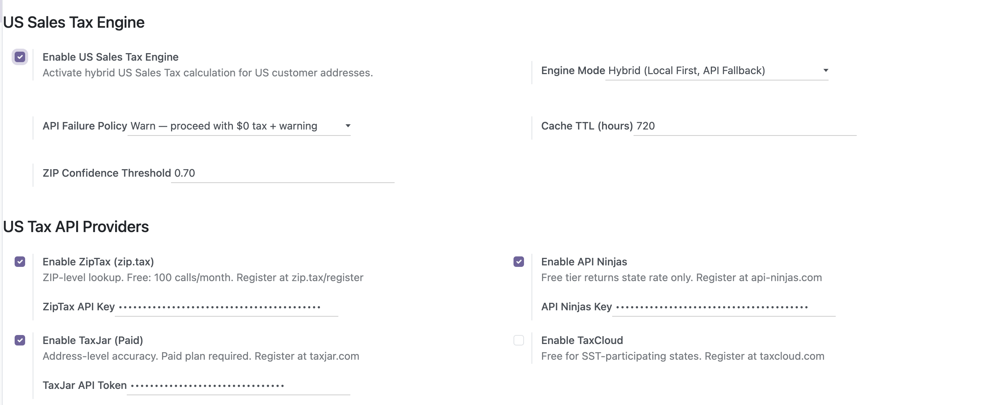

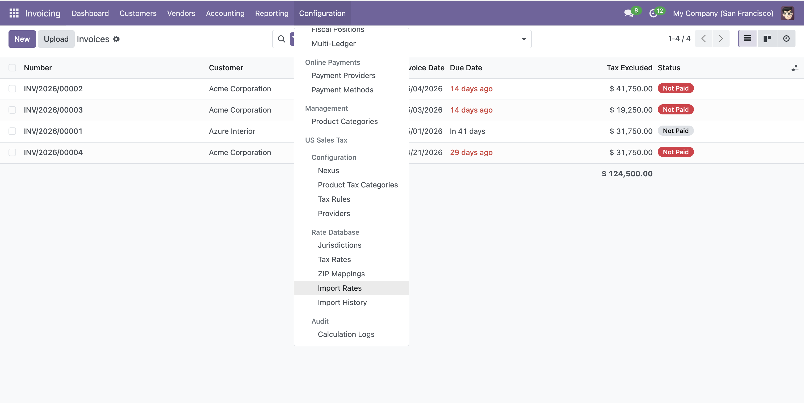

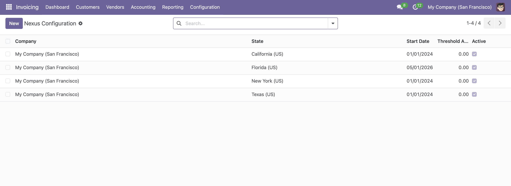

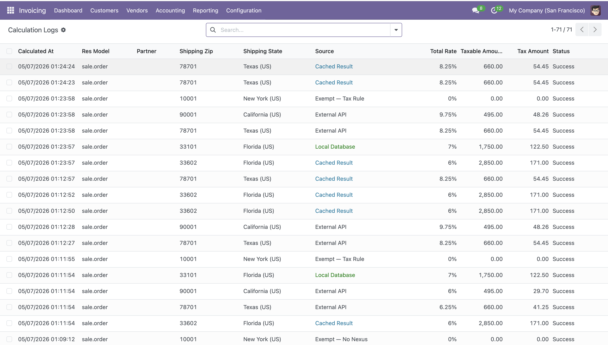

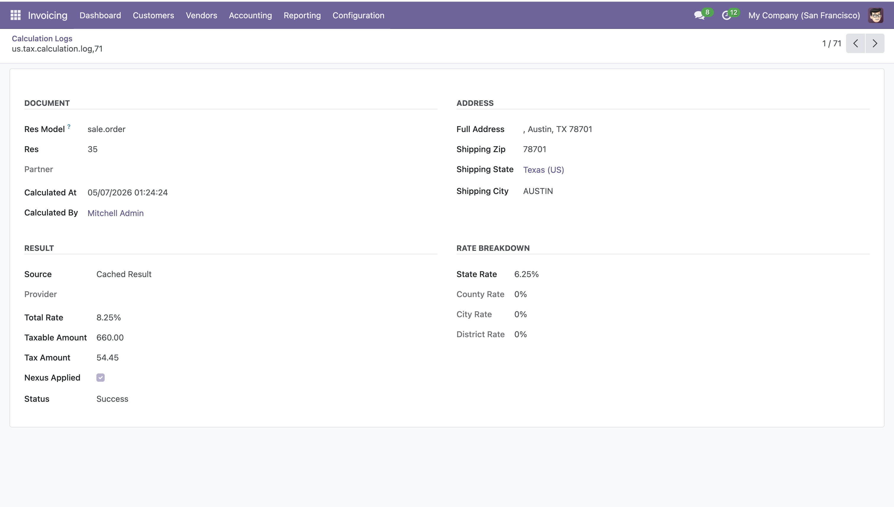

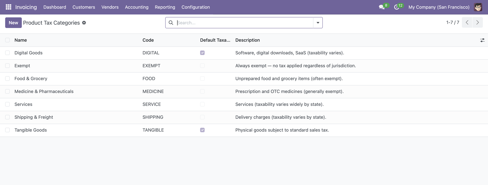

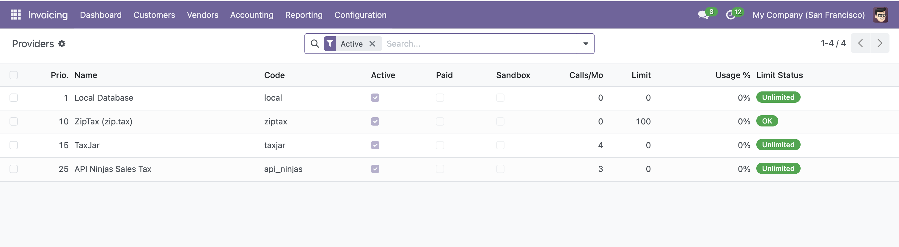

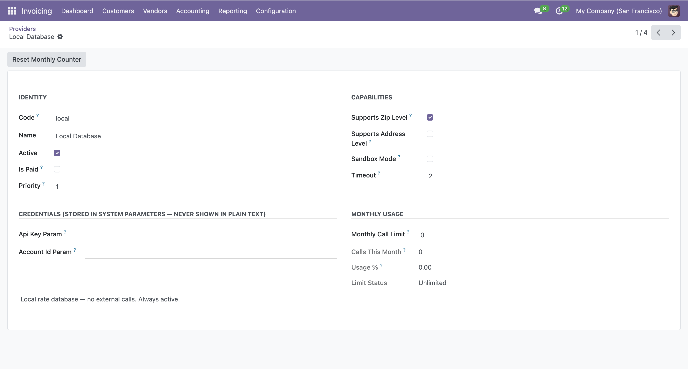

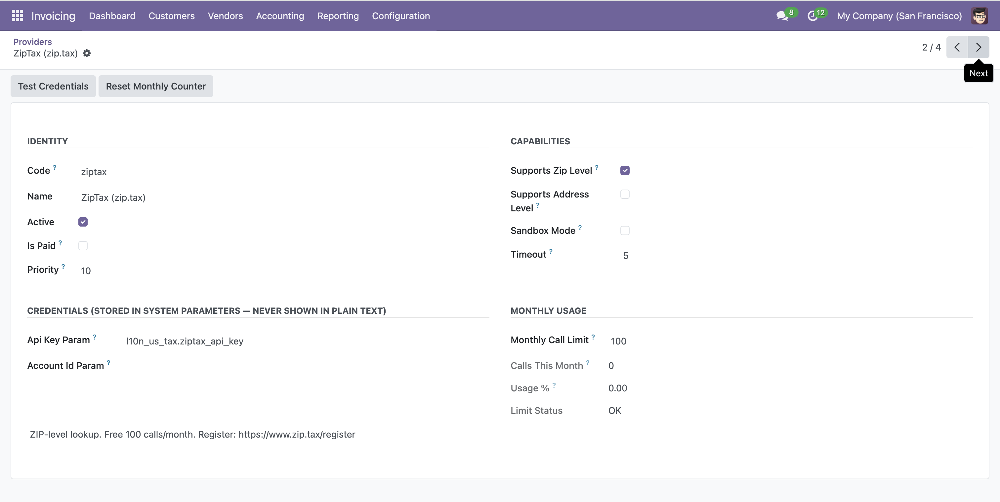

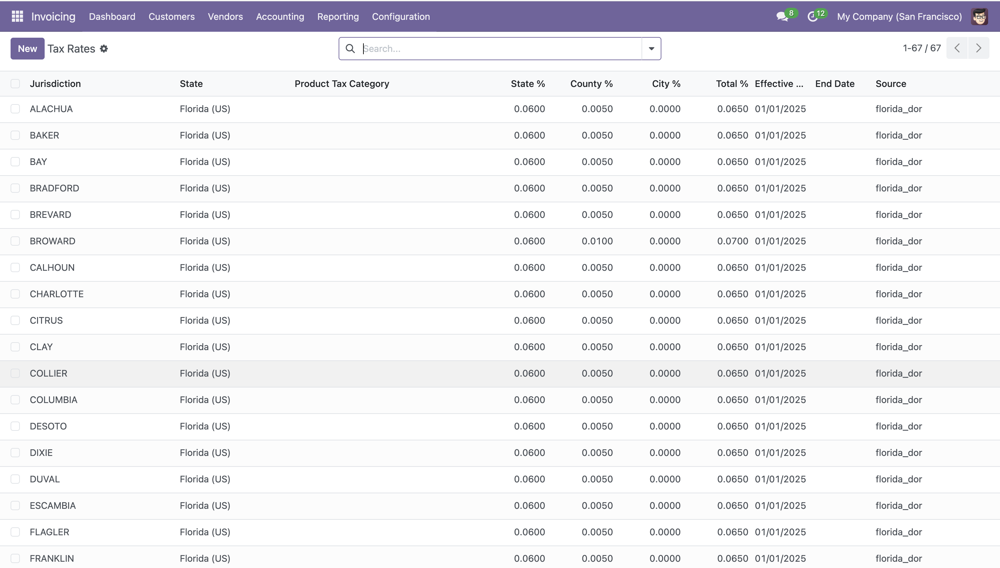

Known Issues / Roadmap
-----------------------

* Automated filing / remittance is not included (Phase 2)
* Full exemption certificate management is not included (Phase 2)
* Texas and other states require manual CSV import (Florida DOR included by default)

Bug Tracker
-----------

Bugs are tracked on `GitHub Issues <https://github.com/OCA/l10n-usa/issues>`_.
In case of trouble, please check there if your issue has already been reported.
If you spotted it first, help us by providing detailed and welcome feedback.

Credits
-------

Authors
~~~~~~~

* Carlos R. Rodriguez

Contributors
~~~~~~~~~~~~

* Carlos R. Rodriguez <c.rodriguez@binhex.cloud>

Maintainers
~~~~~~~~~~~

This module is maintained by the OCA.

.. image:: https://odoo-community.org/logo.png
   :alt: Odoo Community Association
   :target: https://odoo-community.org

OCA, or the Odoo Community Association, is a nonprofit organization whose
mission is to support the collaborative development of Odoo features and
promote its widespread use.

This module is part of the `OCA/l10n-usa <https://github.com/OCA/l10n-usa/tree/18.0/l10n_us_sales_tax_engine>`_
project on GitHub.

You are welcome to contribute.
